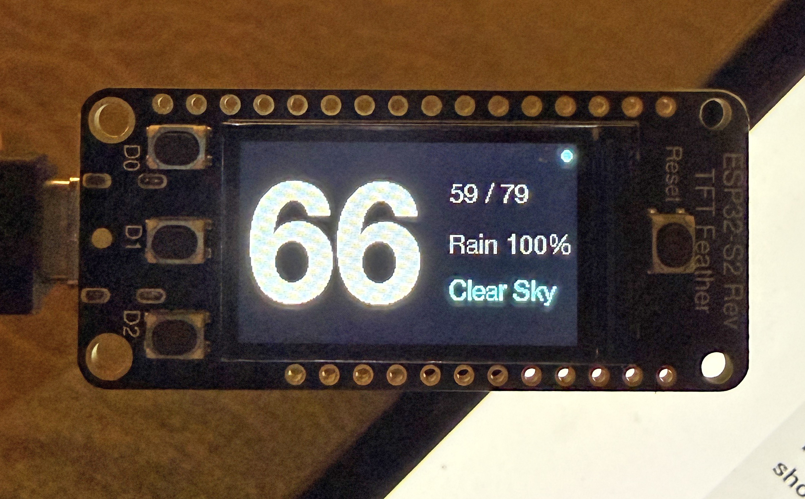

# display-weather



ESP32-S2 firmware that turns an [Adafruit Feather ESP32-S2 Reverse TFT](https://www.adafruit.com/product/5345) into a desktop weather display. Shows the current temperature, conditions, today's high/low, and chance of precipitation on the 240×135 TFT, refreshed from OpenWeatherMap.

## Features

- First-boot captive-portal setup: wifi, latitude/longitude, OpenWeatherMap API key, refresh interval
- Pulls `/data/3.0/onecall` (current + today's daily) from `api.openweathermap.org`
- Configurable refresh interval (5–240 minutes, default 30)
- Tiny wifi-status dot in the top corner (no clock, no city name — clean display)
- Stale-data marker (`*`) if a refresh fails for longer than 2× the interval
- Press **D0** at any time to force an immediate refresh
- Hold **D0** for two seconds at power-on to wipe config and re-enter setup

## Hardware

- [Adafruit Feather ESP32-S2 Reverse TFT](https://www.adafruit.com/product/5345) (240×135 ST7789, three user buttons, native USB)
- USB-C cable

## Build & flash

Requires [PlatformIO Core](https://platformio.org/install/cli).

```sh
# Build only (no upload)
pio run

# Build + upload (waits for the board to appear on /dev/cu.usbmodem*)
scripts/flash.sh

# Open the serial monitor
scripts/monitor.sh
```

### ESP32-S2 bootloader gotcha

The S2 has native USB instead of a USB-to-serial chip, so the automatic `1200bps`-reset trick PlatformIO uses to drop into the bootloader is unreliable. If `scripts/flash.sh` fails with `Failed to connect to ESP32-S2: No serial data received`, put the board into ROM bootloader mode manually:

1. Hold **BOOT** (the D0 button)
2. Press and release **RESET** while still holding BOOT
3. Release BOOT

The port name will change (e.g. `/dev/cu.usbmodem101` → `/dev/cu.usbmodem01`). Re-run `scripts/flash.sh`; press **RESET** once when it finishes to run the new firmware.

## Fonts

The display renders in **Helvetica Neue**, converted to Adafruit-GFX bitmap fonts. Because Helvetica Neue is Apple's proprietary font, neither the source `HelveticaNeue.ttc` nor the generated headers (`src/fonts/HelveticaNeue*pt7b.h`) are committed — they're gitignored. Only the hand-written aggregator `src/fonts/helvetica_neue.h` is tracked.

So after cloning you must generate the font headers once before building:

```sh
# 1. Provide the font (macOS ships it):
cp /System/Library/Fonts/HelveticaNeue.ttc .

# 2. One-time tooling:
brew install freetype
pip3 install fonttools

# 3. Fetch the Adafruit GFX library (which carries fontconvert), then generate:
pio run                 # populates .pio/libdeps (safe to interrupt after it resolves deps)
scripts/gen_fonts.sh    # writes src/fonts/HelveticaNeue{Regular8,Medium10,Bold26}pt7b.h
```

`scripts/gen_fonts.sh` builds Adafruit's `fontconvert`, splits the three weights it needs out of the `.ttc` (fontconvert only reads face 0 of a file), and rasterizes them. The three faces, and where they're used:

| Header | Weight / size | Glyphs | Used for |
|---|---|---|---|
| `HelveticaNeueRegular8pt7b` | Regular 8pt | full ASCII | hints, footers, URLs |
| `HelveticaNeueRegular9pt7b` | Regular 9pt | full ASCII | weather right column (low/high, precip, description) |
| `HelveticaNeueMedium10pt7b` | Medium 10pt | full ASCII | headers, boot screens |
| `HelveticaNeueBold30pt7b` | Bold 30pt | `*`–`:` only | factory-reset countdown digit |
| `HelveticaNeueBold57pt7b` | Bold 57pt | `*`–`:` only | full-height temperature |

To restyle (different weights, sizes, or glyph ranges), edit the `fontconvert` invocations at the bottom of `scripts/gen_fonts.sh` and re-run it. Substituting a different typeface only requires dropping in your own `HelveticaNeue.ttc`-equivalent and adjusting the face indices.

## First-boot setup

1. After flashing, the TFT shows `Setup mode` with an AP name and `192.168.4.1`.
2. From your phone or laptop, join the `WeatherDisplay-Setup` open wifi network.
3. The captive portal page opens automatically. Pick your home wifi, enter its password, then fill in:
   - **Latitude / Longitude** — e.g. `44.9778` / `-93.2650`. *Optional* if you provide a WiGLE token below.
   - **OpenWeatherMap API key** — get one at <https://openweathermap.org/api>
   - **WiGLE API token** *(optional)* — paste the "Encoded for use" string from your [WiGLE API token page](https://wigle.net/account). If lat/lon are blank, the device scans nearby BSSIDs after connecting and asks WiGLE to derive coordinates.
   - **Update every N minutes** — default `30`
4. Save. The device reboots, connects to wifi, optionally runs the WiGLE lookup, and starts displaying.

You must provide either explicit lat/lon **or** a WiGLE token (or both — the explicit coords win).

## Buttons

| Button | While running |
|---|---|
| **D0** (BOOT) | Force an immediate refresh |
| **D0 held at boot for 2s** | Factory reset (clears wifi + weather config, re-enters setup) |

D1 and D2 are unused.

## File layout

```
src/
  main.cpp              top-level state machine + loop
  config.h              pins, colors, URLs, defaults
  storage.h/.cpp        NVS-backed config (lat, lon, api_key, update_min)
  wifi_setup.h/.cpp     WiFiManager wrapper + factory reset
  weather_fetcher.h/.cpp OpenWeatherMap one-call client
  display.h/.cpp        ST7789 drawing
  buttons.h/.cpp        debounced edge-triggered button events
  fonts/
    helvetica_neue.h    aggregator (tracked); includes the generated headers below
    HelveticaNeue*pt7b.h  generated GFX fonts (gitignored — see "Fonts")
scripts/
  flash.sh              wait for port, build, upload
  monitor.sh            wait for port, open serial monitor
  gen_fonts.sh          regenerate the GFX font headers from HelveticaNeue.ttc
  _wait_for_board.sh    shared port-wait helper
```

## Caveats

- **TLS uses `setInsecure()`** — no certificate validation. Reasonable for a personal device on a home LAN; do not deploy outside that threat model.
- The OpenWeatherMap free tier currently allows up to 1,000 One Call API requests per day. With the default 30-minute refresh that's 48 requests/day; even at the 5-minute minimum it's 288/day.

## License

No license declared. Add one if you want to make the code reusable.
